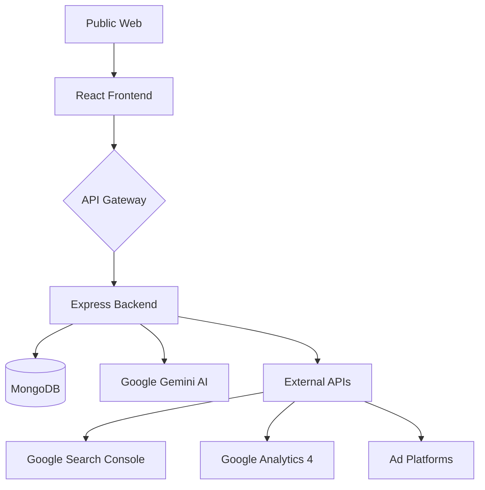

# 🚀 RankPilot: AI-Powered Analytics Intelligence


RankPilot is a premium, state-of-the-art **AI-Powered Analytics Intelligence Platform** designed to revolutionize how marketing data is understood and leveraged. Built on the **MERN stack**, it integrates seamlessly with industry-standard platforms like Google Search Console, Google Analytics 4, Google Ads, and Meta Ads to provide actionable insights via natural language questioning.

---

## ✨ Key Features

- **🧠 Neural AI Insights**: Powered by **Google Gemini**, the platform allows you to query your marketing data in plain English and receive deep analysis, trends, and optimization suggestions.
- **📊 Multi-Source Integration**: Unified dashboard for **Google Search Console (GSC)**, **Google Analytics 4 (GA4)**, **Google Ads**, and **Meta Ads**.
- **🔄 Historical & Automated Sync**: Automated daily data synchronization coupled with a robust historical data ingestion engine for comprehensive long-term analysis.
- **🌓 Premium UI/UX**: A high-performance dashboard featuring **Glassmorphism**, smooth **Micro-animations**, and **Dynamic Charts** (Recharts) supporting both Light and Dark modes.
- **🎯 Growth Opportunity Detection**: Automatically identifies low-CTR keywords, ranking "near page one" opportunities, and device-specific trends.
- **🔐 Enterprise Security**: Secure OAuth2.0 authentication for Google and Facebook, encrypted database fields, and rate-limiting.

---

## 🛠️ Tech Stack

### Frontend
- **React 19 (Vite)**: Ultra-fast UI development and rendering.
- **Tailwind CSS**: Modern, responsive styling with custom design tokens.
- **Zustand**: Lightweight and scalable state management.
- **Recharts**: Advanced data visualizations and traffic resonance mapping.
- **React-Router-Dom**: Smooth client-side navigation.

### Backend
- **Node.js & Express**: High-concurrency server architecture.
- **MongoDB & Mongoose**: Flexible NoSQL data modeling.
- **Google Cloud APIs**: Direct integration with GSC, GA4, and Google Ads.
- **Passport.js**: Robust authentication strategies (JWT, Google OAuth, Facebook).
- **Node-Cron**: Intelligent job scheduling for automated data syncs.

---

## ⚡ Quick Start

### Prerequisites
- Node.js (v18 or higher)
- MongoDB (Local or Atlas)
- Google Cloud & Meta Developer Credentials

### Installation

1. **Clone the repository**
   ```bash
   git clone <repo-url>
   cd RankPilot
   ```

2. **Install Dependencies**
   ```bash
   npm run install:all
   ```

3. **Configure Environment Variables**
   Create a `.env` file in the `/server` directory:
   ```env
   PORT=5001
   MONGODB_URI=your_mongodb_uri
   JWT_SECRET=your_secret
   GOOGLE_CLIENT_ID=your_id
   GOOGLE_CLIENT_SECRET=your_secret
   GEMINI_API_KEY=your_key
   # See .env.example for full list
   ```

4. **Launch Application**
   ```bash
   npm run dev
   ```
   *Frontend: http://localhost:5173*  
   *Backend: http://localhost:5001*

---

## 📁 Architecture Overview



---

## 📄 License

RankPilot is distributed under the MIT License. See `LICENSE` for more information.

---

Built with ❤️ for Data-Driven Marketers.